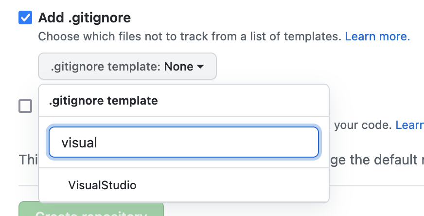
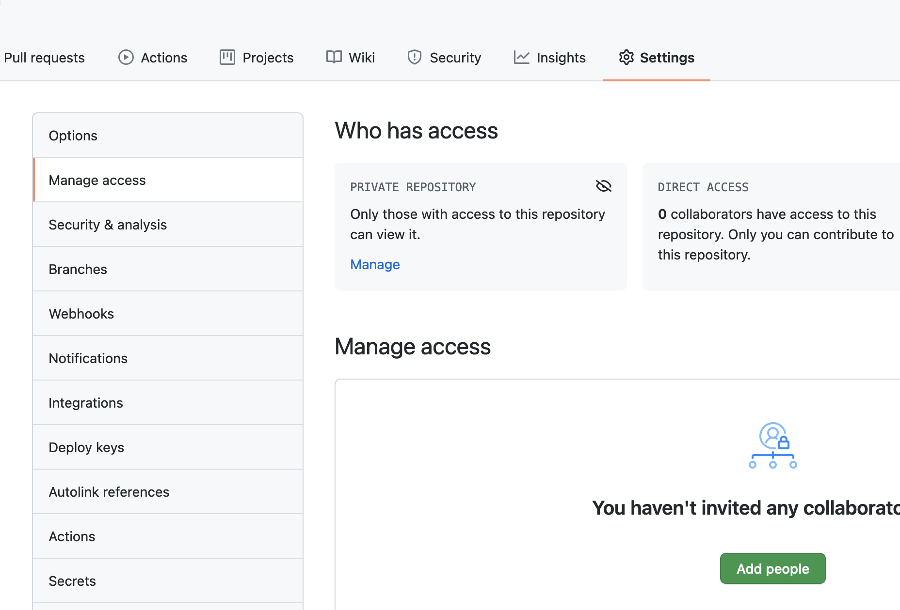
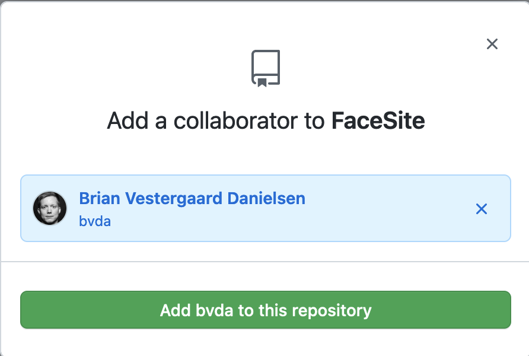
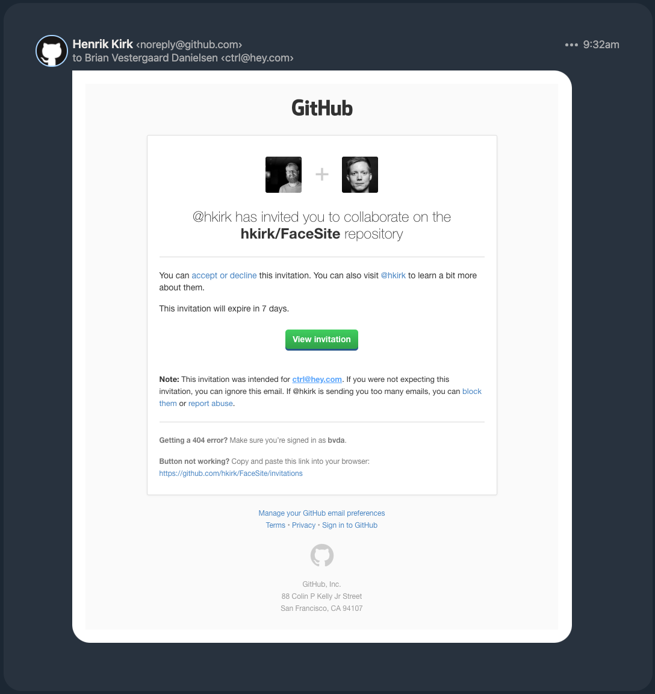
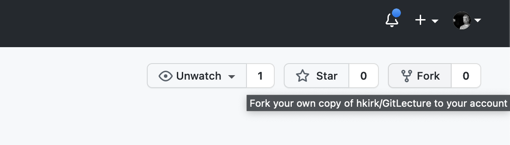
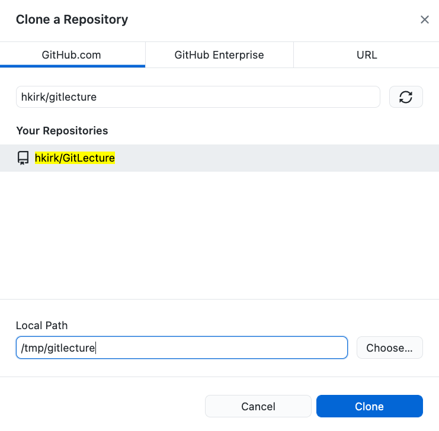
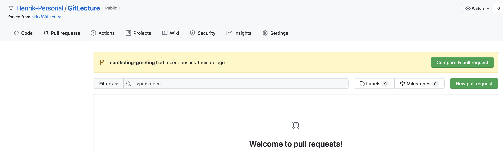
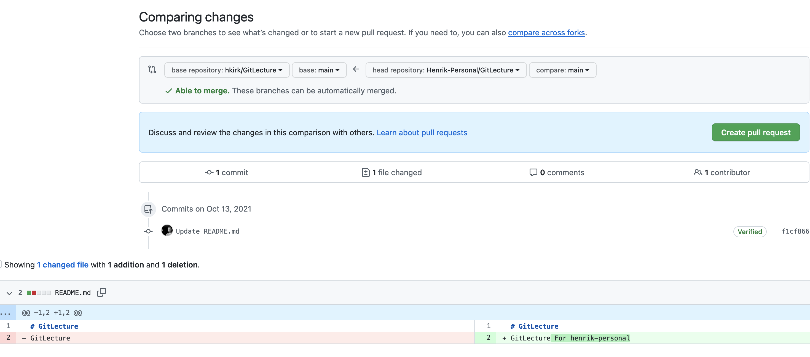
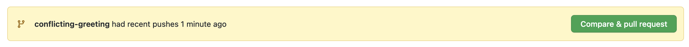

<!-- .slide: data-background="#003d73" -->
## Git + GitHub

 <!-- .element style="position: absolute; top: 200px; left: 50px" -->

----

## Agenda

* What is Git & GitHub
* How do I use Git & GitHub
* Lots of work
* Slides and code: https://github.com/bvda/hack-your-education-ece

---

## Git and GitHub Desktop install

* Windows (https://git-scm.com/download/win)
* Mac (https://git-scm.com/download/mac)
* Linux (apt): sudo apt-get install git
* Linux (yum): sudo yum install git
* *Optional*: GitHub Desktop

----

### What is Version control

* A system that keeps records of your change history
* Allows a group to develop together
* Creates a history of changes
* Gives the posibility to revert to an ealier state

----

### Why?

* We make mistakes
* We want to track the reason why something changed
* We want to work together easily

----

### What is Git

* Distributed version control
* Each user keep entire history and code on local machine
     * Changes can be made in offline mode
     * Require internet to share - ofcourse :)
* There are other VCS system out there
    * Subversion
    * CVS
    * etc.

----

### What is GitHub

* Place to host and share repositories
* Create an account on [www.github.com](http://www.github.com)
    * Free with limits
* On top of git
    * UI, documentation, bug tracking, feature request, pull request
* GitHub is one platform:
    * Bitbucket, GitLab etc. are alternatives

---

## Create project locally

Locally on console

```shell
$ git init
## later attach a remote repository
$ git add remote origin https://github.com/hkirk/FaceSite
```

----

### .gitignore

* Just a file called '.gitignore'
* Which contains 'regexp' of files to be ignored

```
.svn
log/*.log
tmp/**
node_modules/
.sass-cache
```

----

### or on GitHub

 <!-- .element: style="height: 600px" -->

----

### Ignore

 <!-- .element: style="height: 300px" -->

----

### Add collaborators

 <!-- .element: style="height: 400px" -->


----

### Invite users

 <!-- .element: style="height: 300px" -->

----

### Confirmation

Remember to answer confirmation email

 <!-- .element: style="height: 500px" -->

----

## Fork repository

1. Goto www.github.com/hkirk/GitLecture
2. Fork this to optain you own copy on GitHub
 <!-- .element: style="height: 150px" -->

----

### 3. Cloning 

Commandline 

```shell
$ git clone git@github.com:_yourHandle_/GitLecture.git
```

or via GitHub Desktop



Note:
If you have cloned before forking

```
$ git remote -v
$ git remote remove origin
$ git remote add origin git@github.com:Henrik-Personal/GitLecture.git
$ git push --set-upstream origin main
```

----

### Exercise

1. Go to github.com and search for `hkirk/gitlecture`
2. Make a personal fork of the lecture
3. Clone the project to you local pc (command line or using Github Desktop)

---

### Repository

* A collection of the files
* and their history
* Will exists locally and possible also on a remote server
    * cloning is the act of copying the content
* Pulling from a repository
    * copying remote changes to local
* Pushing to a repository
    * moving local changes to remote

----

### Commit 

* The act of creating a snapshot
    * and the actually snapshot
* A repository consists of a series of commits
* Each commit consists of
    * information about how file has changed
    * reference to previous commit (parent commit)
    * a hash code

```
A --- B ---- C --- D main
```

----

### Basic Git commands 1

* **status**
    * shows which branch you are one (more about branches later)
    * shows working tree information
    * shows how your branch are compared to remote branch
* **log**
    * shows you snapshot history
    * *-n*, *--oneline*, *--graph*

----

### Basic git commands 2

* **add**
    * adds file to staging
* **commit**
    * commits files added to staging to repository
    * *-m* 

----

## Other usefull (non-git) commands

* **touch**
    * creates an empty file
* **echo**
    * prints
* **>>**
    * appends output from left side to file on right side
    * `echo "Hej" >> file.txt`
* **>**
    * overwrites file on right side

----

### Exercise
#### What is in the directory

1. What does **status** and **log** say in GitLecture?
2. Create a file 'plan.txt' and **add** to staging
3. Check *status*
4. **add** and **commit** and check **status**
5. Change content of 'plan.txt'
6. Check **status**, 
7. Then **add** and **commit** 
7. How does the **log** look now?

---

## Branches

* A commit must 'live' on some branch
* There can be many parallel branches simultaneous
* The main branch is typically called `main`, `master` or `development`

----

### Commits

```
A (a_branch) --- B --- C --- D (HEAD / main)
```

* <!-- .element: class="fragment" --> `HEAD` is the most recent commit on current branch
* <!-- .element: class="fragment" --> `main` is the branch

----

### Branches

```
    --- E (login_feature)
   /
A --- B --- C --- F (HEAD / main)
               \
                --- D --- G --- H (profile_feature)
```

----

### Commands regarding branches

* **branch**
    * Lists all local branches
* **branch -r**
    * Lists all branches
* **branch [name]**
    * Creates a new branch
* **checkout [name]**
    * switches to given branch
* **checkout -b [name]**
    * Creates the branch and switch to new branch
* **diff [name]**
    * Show differences on current and `[name]` branched

----

<!-- .slide: style="font-size: 0.8em" -->

### Exercises
##### Branching

1. Which branch are you on?
2. Create a new **branch** '[initials]-branch', and show branches
3. Switch to the new branch and watch what the **status** displays now
4. How do you workspace now look?
5. Create a new file 'file.txt' containing you name
6. **Add** file and commit, check **log**
7. Switch back to the main branch
8. Create a file 'file2.txt' with some code
9. Add a commit file and check **log**
10. What are the difference on main and your new branch

---

### Merging

* Once a feature is done - you want to merge it back to you 'main' branch

```
      A---B---C topic
     /
D---E---F---G  main
```

```
$ git merge topic
```
<!-- .element: class="fragment" -->

```
      A---B---C topic
     /         \
D---E---F---G---H main
```
<!-- .element: class="fragment" --> 

----

### Cleanup

* **branch -d [name]**
    * Deletes the branch with `[name]`


Note: 

**merge** and **diff**  can handle multiple branches at once

----

<!-- .slide: style="font-size: 0.8em" -->

### Exercise
##### Merging

1. Create a **branch** 'uppercase' and check this out.
2. Edit the file greeting.txt and make an uppercase greeting
3. **Stage** the file and **commit**. Check **log** with **`--oneline --graph --all`**
4. Checkout the 'main' branch
5. Check content of greeting.txt with `$ cat greeting.txt` or in an text editor
6. What is the **diff**erence between branches 'uppercase' into 'main'
7. Then **merge** 'uppercase' into 'main'
8. What is the content of greeting.txt now?
9. Delete the uppercase branch

----

### Fixing conflicts

* Merging a branch can resolve in conflicts
    * This is merges that git cannot it self resolve.
* Example of conflict in a file
```
<<<<<<< HEAD
foreach (var i in range)
{
=======
for (int i = 0; i < 10; i++)
{
>>>>>>> conflicting-branch
```

----

### Resolving conflicts

* **status** will show unmerge paths
* Steps:
    1. Manually resolve each file
        * open file in editor and fix content
    2. **add** add each file to mark resolution
    3. To abord merge **merge --abort**

----

### Remove branches

* **switch [name]** 
    * fecthes and tracks a remote branch
    * shorthand for **checkout --track [remote]/[name]**

----

### Exercise
##### working with conflicts

1. **merge** the branch 'origin/conflicting-greeting' 
2. Use **status** to show changes
3. Use an editor to fix the conflicts
4. **status** also show instructions for how to resolve conflicts
5. What do **'log --oneline --graph --all'** show now?

---

## Amend

* Some times we commit and miss something important
     * amend can help us fix this

* **amend**
    * Replaces lastest commit on current branch

----

### Exercise
##### using amend

1. Create a file 'bar.txt', **add** and **commit**
2. What do **status** look like?
3. What do **log -p** show?
4. Note which name you think appears the most on the enrollment list for today
5. Add name to 'bar.txt' and stage it
6. Amend these changes by **commit --amend**
7. Check **log -p**
8. Try amending againg, what happens?

---

<!-- .slide: style="font-size: 0.9em" -->

## Sharing with collaborators

* **push**
    * Pushes current branch to remote
* **push --set-upstream <remote> <branch>**
    * Tells which remote a branch should be pushed to as default
    * Only nessesary for new branches
* **pull**
    * Incorporates changes from remote into current branch
    * shorthand for `git fetch; git merge FETCH_HEAD`

----

### Pull requests

* Forking a repository on GitHub creates a new repository with the same code
    * and a link between these
    * you (hopefully) have already done this
* A pull requests is the mechanism to synchronize the two repositories

Note: if you share access to a private repository pull request is no nessesary - because there are only one repository.

----

### Creating a pull request 1



----

### Creating a pull request 1



----

### Updates from main repository



----

### Exercise
##### Working with GitHub

1. **push** your changes on the branches 'main' and '[initials]-branch' to your GitHub account
2. Create a pull request to 'hkirk/GitLecture'

---

### Next events


* 6. October - Version control **&#9745;**
* 13. October - Debugging  **&#9744;**
* 27. October - Problem solving  **&#9744;**
* 10. November - Scripting  **&#9744;**

---

### GitHub Education

1. Go to https://education.github.com/students
2. Sign up with your AU mail
3. ????
4. PROFIT!

## References:

* [A Visual Git Reference](http://marklodato.github.io/visual-git-guide/index-en.html)
* [Git as a game](https://ohmygit.org/)
* [Code and slides on Git](https://github.com/bvda/hack-your-education-ece)


