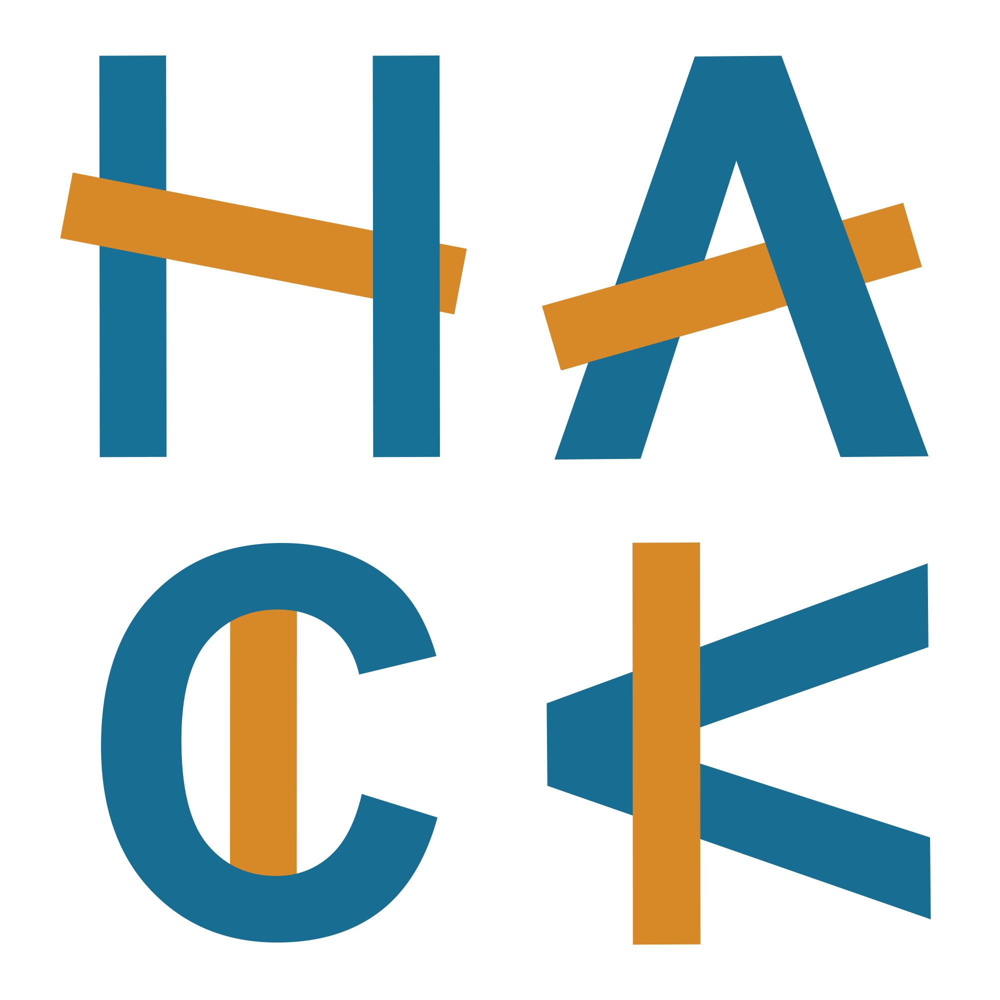

<!-- .slide: data-background="#003d73" -->
## Git + Github

 <!-- .element style="width: 200px; position: absolute; top: 200px; left: 50px" -->

----

## Agenda

* What is Git / Github
* How do I use Git / Github

---

## Install

* Windows (https://git-scm.com/download/win)
* Mac (https://git-scm.com/download/mac)
* Linux (apt): sudo apt-get install git
* Linux (yum): sudo yum install git

----

### What is Version control

* A system that keeps records of your change history
* Allows a group to develop together
* Creates a history of changes
* Gives the posibility to revert to an ealier state

----

### Why?

* We make mistakes
* We want to track the reason why something changed
* TODO: Other?

----

### What is Git

* Distributed version control
* Each user keep entire history and code on local machine
     * Changes can be made in offline mode
     * Require internet to share (ofcourse :))
* There are other VCS system out there
    * Subversion
    * CVS
    * etc.

----

### What is Github

* Place to host and share repositories
* Create an account on (www.github.com)[www.github.com]
    * Free with limits
* On top of Git
    * UI, documentation, bug tracking, feature request, pull request

---

### Create project on Github

 <!-- .element: style="height: 600px" -->

----

### Add collaborators

 <!-- .element: style="height: 600px" -->


----

### Invite users

 <!-- .element: style="height: 300px" -->

----

### Confirmation

Remember to answer confirmation email

 <!-- .element: style="height: 600px" -->

----

### Create project localy

Or locally on console

```shell
$ git init
## later attach a remote repository
$ git add remote origin https://github.com/hkirk/FaceSite
```

---

### Commit 

* The act of creating a snapshot
* A repository consists of a series of commits
* Each commit consists of
    * Information about how file has changed
    * Reference to previous commit (parent commit)
    * A hash code

----

### Repository

* A collection of the files
* and their history
* Will live locally and possible also on a remote server
    * Cloning is the act of copying the content
* Pulling from a repository
    * Copying remote changes to local
* Pushing to a repository
    * Moving local changes to remote

----

## Downloading repository

```shell
$ git clone git@github.com:hkirk/GitLecture.git
```

or


----

### Basic Git commands

* **status**
    * shows which branch you are one (more about branches later)
    * shows working tree information
    * shows how your branch are compared to remove branch
* **log**
    * shows you snapshot history
    * *-n*, *--oneline*, *--graph*
* **add**
    * adds file to staging
* **commit**
    * commits files added to staging to repository
    * *-m* 

----

## Other usefull commands

* **touch**: creates an empty file
* **echo**: prints
* **>>**: appends output from left side to file on right side
    * `echo "Hej" >> file.txt`
* **>**: overwrites file on right side

----

### What is in the directory

1. What does *status* and *log* say in GitLecture?
2. Create a file 'plan.txt' and *add* to staging
3. Check *status*
4. *Commit* and check *status*
5. Change content of 'plan.txt'
6. Check *status*, *commit* 
7. How does the *log* look now?

---

## Branches

* A commit must 'live' on some branch
* There can be many parallel branches simultanius
* The main branch is typically called 'main' og 'master'

----

### checkout and reset


----

### Ignore


----

git amend


---

## Branch

----

## Pull request

TODO github:

----

## Merge


git diff / github diff

----

