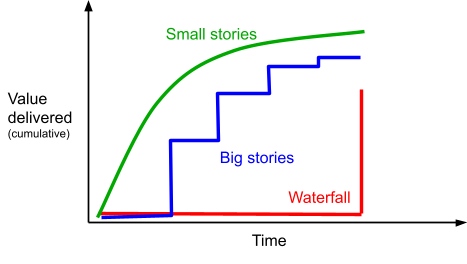

<!-- .slide: data-background="#003d73" -->
## Problem solving + Basic skills

 <!-- .element style="width: 200px; position: absolute; top: 200px; left: 50px" -->

----

### TODO Today

* Basic skills
* Problem solving

---

## Basic skills

What is taught on real courses:

* Programing language
  * Control flow, methods/function
  * OORPG, OOP, ITS1, ITS2, Programmering, ..
* Data structures
  * List, queue, stack, tree
  * DOA, Algoritmer og Datastrukure
* Software architecture & design
  * SWD, ITS3, Software Architecture, 

----

### Learn you editor?

* Shortcuts ([VS Code](https://code.visualstudio.com/shortcuts/keyboard-shortcuts-windows.pdf), [VS 2019](https://visualstudiomagazine.com/articles/2019/06/06/visual-studio-productivity.aspx), [Rider](https://www.jetbrains.com/help/rider/mastering_keyboard_shortcuts.html))
* Views
* Plugins / extensions


----

#### C / C++ / C#

* Visual Studio does everything
  *  But what actually happens?
*<!-- .element: class="fragment" data-fragment-index="1" --> C & C++ The compiler:
  * E.g. `GCC`
*<!-- .element: class="fragment" data-fragment-index="2" --> For C# the compiler is called:
  * .Net Core: `dotnet build`
  * .Net: `csc.exe` 

*<!-- .element: class="fragment" data-fragment-index="3" --> Many errors are reported by the compiler

----

#### JavaScript

* JavaScript files can be 'executed' directly in browser.
*<!-- .element: class="fragment" data-fragment-index="1" --> TypeScript (Superset of JavaScript)
  * Must be transpiled to JavaScript
  * Requires a tool chain tools e.g. Gulp

```javascript
gulp.task('serve', () => {
    connect.server({
      root: root, port: port,
      host: '0.0.0.0', livereload: true
    })

    gulp.watch(['*.html', '*.md'], gulp.series('reload'))
    ...
```
<!-- .element: class="fragment" data-fragment-index="2" -->

----

### Toolchains

* Do you use any other tools?
    * Cross compilation, linting, obfuscating, etc.?
    * Are errors coming from these?

----

### What is good code?

* Correct indention
* Readability
* High Cohesion
* Low Coupling

```csharp
if(a < EARLIEST_HOUR && b < EARLIEST_HOUR
&& c < EARLIEST_HOUR)
a = EARLIEST_HOUR; b = EARLIEST_HOUR; c = EARLIEST_HOUR;
```

----

```csharp
public class TennisGame3 : ITennisGame {
  private int p2; private int p1;
  private string p1N; private string p2N;

  public TennisGame3(string player1Name, string player2Name)
  {
    this.p1N = player1Name;
    this.p2N = player2Name;
  }

  public string GetScore() {
    string s;
    if ((p1 < 4 && p2 < 4) && (p1 + p2 < 6)) {
      string[] p = { "Love", "Fifteen", "Thirty", "Forty" };
      s = p[p1];
      return (p1 == p2) ? s + "-All" : s + "-" + p[p2];
    }
    else {
      if (p1 == p2)
        return "Deuce";
      s = p1 > p2 ? p1N : p2N;
      return ((p1 - p2) * (p1 - p2) == 1)
                  ? "Advantage " + s
                  : "Win for " + s;
    }
  }
  public void WonPoint(string playerName) {
    if (playerName == "player1")
      this.p1 += 1;
    else
      this.p2 += 1;
  }
}
```


----

### When is it good enough?

* Does it solve the problem?
  * Look at problem statement / exercise desciption
*<!-- .element: class="fragment" data-fragment-index="1" --> Any known bugs?
  * Small cosmetic errors?
  * Big functional errors?
*<!-- .element: class="fragment" data-fragment-index="2" --> Do you know how to solve these?

---

## Problem solving

* _Always_ have a plan
* Restate problem
* Divide the problem
* Start with what you know
* Reduce the problem

----

### Half of a square

Write a program that given a number lets say 5, prints half of a 5*5 square.

```
#####
####
###
##
#
```

----

### Solving the problem

* You properly know how to print a full square given the number 5
```
#####
#####
#####
#####
#####
```

Or at least<!-- .element: class="fragment" data-fragment-index="1" -->

```
#####
```
<!-- .element: class="fragment" data-fragment-index="1" -->

----

### Counting down

Can you write an `expression` in the loop such that it prints the numbers `5` through `1`?


```csharp
for (int row = 1; row <= 5; row++) {
   Console.WriteLine(`expression`);
}
```

Maybe<!-- .element: class="fragment" data-fragment-index="2" --> '`row * -1`'

----

### Conting down (cont.)

| Row | Desired | 'Row * -1' | Difference |
|-----|---------|---------|------------|
| 1 | 5 | -1 | 6 |
| 2 | 4 | -2 | 6 |
| 3 | 3 | -3 | 6 |
| 4 | 2 | -4 | 6 |
| 5 | 1 | -5 | 6 |

* Formula must be<!-- .element: class="fragment" data-fragment-index="2" --> `(Row * -1) + 6`
  * or just `6 - Row`

----

#### A final solution

```csharp
for (int row = 1; row <= 5; row++) {
    for (int j = 1; j <= 6-row; j++) {
        Console.Write("#");
    }
    Console.Write("\n");
}
```

---

## Lets slice an elephant

 <!-- .element style="width: 400px" -->

----

### User stories vs Use case

"`User Stories` are centered on the result and the benefit of the thing you're describing, whereas `Use Cases` can be more granular, and describe how your system will act"

* Both has a role, goal, and acceptance
* User story contain fewer details
* Use cases have all details up front

----

### User stories

We will use this definition:

**User story**: vertical, testable, user valued.


----

### User stories

* Vertical:
  * Cut accross multiple layers in the architecture
* Testable:
  * Should be testable either by code or manually
* User valued:
  * Should bring value to end user.

----

### User stories examples

Is removing:
```csharp
Console.WriteLine("Hello World")
```
a user good story?

Adding a button to UI?<!-- .element: class="fragment" -->

Setting up project structure? <!-- .element: class="fragment" -->

----

### User story size

* Effort
* Complexity
* Unknowns

----

### User story - how big?

From minutes to months.


----

### Why small stories?

* Problem is divided into smaller parts
* Easier to make a plan
* Easier to recognise known parts

Note:
- Users benefits earlier
  - you make money faster
  - you always have something that works
  - you always have something you can test

----

 <!-- .element: style="height:500px" -->

Note:
Blue: Scrum - harder to test
Waterfall: Customer/users get everything at once - how to test?

---

### Exercise

* Divide into 2-3 persons groups
    * Try meeting new people :-)
* 15 min for breaking down problem into small user stories
* If time allows
    * Start implementing in 8 minute development sprints

----

### Product

* **User input:**
  * How many items
  * Price per item
  * 2-letter state code
* **Output:**
  * Total price
      * Discount based on total price
      * Add state tax based on state and discounted price

----

| Order value | Discount rate| * | State | Tax Rate |
| ---- | ---- | ---- | ---- | ---- |
| 1.000 | 3% | * | UT | 6.85% |
| 5.000 | 5% | * | NV | 8.00% |
| 7.000 | 7% | * | TX | 6.25% |
| 10.000 | 10% | * | AL | 4.00% |
| 50.000 | 15% | * | CA | 8.25% |


----

<!-- .slide: style="font-size: 0.5em" -->

#### User stories <!-- .element: style="font-size:1.3em" -->

1. Input #item
2. Validate input
3. Input price per item
4. Validate price
5. Sum value
6. Present total
7. Calculate discount for 
  1. 1000
  2. 5000
  3. 7000
  4. 10.000
  5. 50.000
8. Input state code
9. Validate state code
10. Present error
11. Calculate tax rate for
  1. UT
  2. NV
  3. TX
  4. AL
  5. CA

---

## Reference

* Think like a programmer by V. Anton Spraul
* Giphy
* https://kata-log.rocks/elephant-carpaccio

