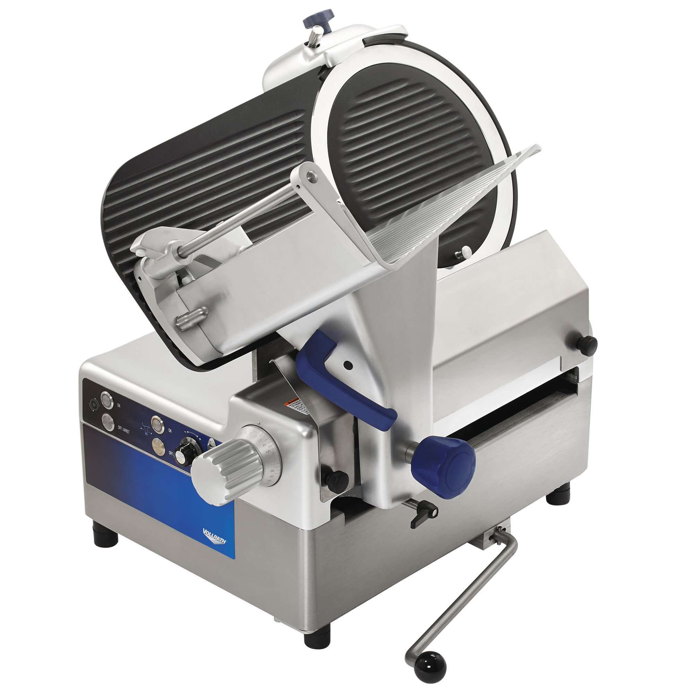

<!-- .slide: data-background-image="./img/intro.jpeg" -->

----

### Today

* Problem Solving
* User stories
* Basic skills
* Code code code

---

## Problem solving

* _Always_ have a plan
* Restate problem
* Divide the problem
* Start with what you know
* Reduce the problem

----

### Always have a plan

*Print Half of a square*

Write a program that
1. given a number lets say `5`
2. prints  `1/2` of a `5*5` square.
```
#####
####
###
##
#
```

----

### Start with what you know

* Print a line of 5's `#` given `5`
```
#####
```
* And maybe even &#128519;<!-- .element: class="fragment" data-fragment-index="1" -->
```
#####
#####
#####
#####
#####
```
<!-- .element: class="fragment" data-fragment-index="1" -->

----

### Restate problem

Can you write an `expression` in the loop, such that it prints the numbers `5` through `1`?


| row     | 1 | 2 | 3 | 4 | 5 |
|-|-|-|-|-|-|
| desired | 5 | 4 | 3 | 2 | 1 |
<!-- .element: style="font-size: 28px" -->

```csharp
for (int row = 1; row <= 5; row++) {
   Console.WriteLine(<<< expression >>>);
}
```

```c
for (int row = 1; row <= 5; row++) {
  printf("%d\n", row);
}
```

Maybe<!-- .element: class="fragment" data-fragment-index="2" --> '`row * -1`'

----

### Counting down

| row | desired | 'row * -1' | difference |
|-----|---------|---------|------------|
| 1 | 5 | -1 | 6 |
| 2 | 4 | -2 | 6 |
| 3 | 3 | -3 | 6 |
| 4 | 2 | -4 | 6 |
| 5 | 1 | -5 | 6 |
<!-- .element: style="font-size: 36px" -->

* so formula must be<!-- .element: class="fragment" data-fragment-index="2" --> `(row * -1) + 6`
  * or just `6 - row`

----

#### A final solution

```csharp
// C#
for (int row = 1; row <= 5; row++) {
    for (int j = 1; j <= 6-row; j++) {
        Console.Write("#");
    }
    Console.Write("\n");
}
```

```c
// C
for (int row = 1; row <= 5; row++) {
  for (int j = 1; j <= 6-row; j++) {
    printf("#");
  }
  printf("\n");
}
```

---

----

<!-- .slide: data-visibility="hidden" -->

### User stories vs Use case

"`User Stories` are centered on the result and the benefit of the thing you're describing, whereas `Use Cases` can be more granular, and describe how your system will act"

* Both has a role, goal, and acceptance
* User story contain fewer details
* Use cases have all details up front

----

### User stories

A way to define a piece of functionality

We will use this definition:

* Vertical:
  * Cut accross multiple layers in the system
* Testable:
  * Should be testable either by code or manually
* User valued:
  * Should bring value to end user.

----

### User stories examples

Is removing:
```csharp
Console.WriteLine("Hello World!")
```
a user good story?

Adding a button to UI?<!-- .element: class="fragment" -->

Setting up project structure? <!-- .element: class="fragment" -->

----

### User story - how big?

From minutes to months.


----

### Why small stories?

Remember? <!-- .element: class="fragment" data-fragment-index="1" -->
* Always have a plan <!-- .element: class="fragment" data-fragment-index="1" -->
* Restate problem <!-- .element: class="fragment" data-fragment-index="1" -->
* Divide the problem <!-- .element: class="fragment" data-fragment-index="1" -->
* Start with what you know <!-- .element: class="fragment" data-fragment-index="1" -->
* Reduce the problem <!-- .element: class="fragment" data-fragment-index="1" -->

----

 <!-- .element: style="height:500px" -->

Note:
Green:
  - Users benefits earlier
    - you make money faster
    - you always have something that works
    - you always have something you can test

Blue: Scrum - harder to test
Waterfall: Customer/users get everything at once - how to test?

---

## Lets slice an elephant

 <!-- .element style="width: 400px" -->

----

<!-- .slide: data-background-image="./img/blank_cropped.jpeg" -->

&nbsp; 

&nbsp; 

* Divide into 2-3 persons groups (**2 min**)
    * Try meeting new people &#128563; &#128561;
* Breaking down problem into small user stories (**15 min**)

----

### Price and VAT calculator

* **User input:**
  * How many items
  * Price per item
  * 2-letter state code
* **Output:**
  * Total price
      * Discount based on total price
      * Add state tax based on state and discounted price

 <!-- .element: style="height: 200px" -->

----

| Order value | Discount rate| * | State | Tax Rate |
| ---- | ---- | ---- | ---- | ---- |
| 1.000 | 3% | * | UT | 6.85% |
| 5.000 | 5% | * | NV | 8.00% |
| 7.000 | 7% | * | TX | 6.25% |
| 10.000 | 10% | * | AL | 4.00% |
| 50.000 | 15% | * | CA | 8.25% |

----

<!-- .slide: data-background-image="./img/hourglass.jpeg" -->

## So lets start

creating those user stories


<countdown time="1020" autostart="yes" />


----

<!-- .slide: style="font-size: 0.7em" -->

#### User stories <!-- .element: style="font-size:1.6em" -->

| User stories | User stories | User stories |
|-|-|-|
| 1. Input #item            | 7.1. 1000              | 10. Present error |
| 2. Validate input         | 7.2. 5000              | 11. Calculate tax rate for |
| 3. Input price per item   | 7.3. 7000              | 11.1. UT |
| 4. Validate price         | 7.4. 10.000            | 11.2. NV
| 5. Sum value              | 7.5. 50.000            | 11.3. TX
| 6. Present total          | 8. Input state code    | 11.4. AL
| 7. Calculate discount for | 9. Validate state code | 11.5. CA


---

<!-- .slide: data-background-image="img/cockpit.jpeg" style="color: white;background-color: #79797988; line-height: 2 " -->

## Learn your tools <!-- .element: style="color: white;" -->

* Programming languages, Data structures, software design
* Your editor ([VS 2022](https://learn.microsoft.com/en-us/visualstudio/ide/productivity-shortcuts?view=vs-2022), [VS Code](https://code.visualstudio.com/shortcuts/keyboard-shortcuts-windows.pdf), [Rider](https://www.jetbrains.com/help/rider/mastering_keyboard_shortcuts.html))
  * Shortcuts, views, plugins
* Other tools
  * linter, obfuscating ...
* Process


----

### What is good code?

* Correct indention
* Readability
* High Cohesion
* Low Coupling

---

### So lets start implementing


* Start implementing in `8 minute` development sprints
* Every 8 minute, `show your progress` to another group

----

## Round 1

<!-- .slide: data-background-image="./img/hourglass.jpeg" -->

TODO: change to 480

<countdown time="15" autostart="yes" playTickSoundLast="10" tickSound="http://soundbible.com/grab.php?id=2044&type=mp3" timeIsUpSound="http://soundbible.com/grab.php?id=1746&type=mp3" />

----

## Round 2

<!-- .slide: data-background-image="./img/hourglass.jpeg" -->

<countdown time="10" autostart="yes" playTickSoundLast="10" tickSound="http://soundbible.com/grab.php?id=2044&type=mp3" timeIsUpSound="http://soundbible.com/grab.php?id=1746&type=mp3" />

----

```csharp
public class TennisGame3 : ITennisGame {
  public string GetScore() {
    string s;
    if ((p1 < 4 && p2 < 4) && (p1 + p2 < 6)) {
    string[] p = { "Love", "Fifteen", "Thirty", "Forty" };
    s = p[p1];
    return (p1 == p2) ? s + "-All" : s + "-" + p[p2];
    }
    else {
    if (p1 == p2)
    return "Deuce";
    s = p1 > p2 ? p1N : p2N;
    return ((p1 - p2) * (p1 - p2) == 1) ? "Advantage " + s : "Win for " + s;
    }
  }
}
```

----

```csharp
public class TennisGame3 : ITennisGame {
  public string GetScore() {
    string s;
    if ((p1 < 4 && p2 < 4) &&
        (p1 + p2 < 6)) {
      string[] p = { "Love", "Fifteen", "Thirty", "Forty" };
      s = p[p1];
      return (p1 == p2)
                 ? s + "-All"
                 : s + "-" + p[p2];
    }
    else {
      if (p1 == p2)
      {
        return "Deuce";
      }
      s = p1 > p2
           ? p1N
           : p2N;
      return ((p1 - p2) * (p1 - p2) == 1)
               ? "Advantage " + s
               : "Win for " + s;
    }
  }
}

```

Note:

```csharp
public class TennisGame3 : ITennisGame {
  private int p2; private int p1;
  private string p1N; private string p2N;

  public TennisGame3(string player1Name, string player2Name) {
    this.p1N = player1Name;
    this.p2N = player2Name;
  }

  public string GetScore() {
    string s;
    if ((p1 < 4 && p2 < 4) && (p1 + p2 < 6)) {
      string[] p = { "Love", "Fifteen", "Thirty", "Forty" };
      s = p[p1];
      return (p1 == p2)
               ? s + "-All"
               : s + "-" + p[p2];
    }
    else {
      if (p1 == p2)
        return "Deuce";
      s = p1 > p2 ? p1N : p2N;
      return ((p1 - p2) * (p1 - p2) == 1)
           ? "Advantage " + s
           : "Win for " + s;
    }
  }
  public void WonPoint(string playerName) {
    if (playerName == "player1")
      this.p1 += 1;
    else
      this.p2 += 1;
  }
}
```

----

### When is it good enough?

* Does it solve the problem?
  * Look at problem statement / exercise desciption
*<!-- .element: class="fragment" data-fragment-index="1" --> Any known bugs?
  * Small cosmetic errors?
  * Big functional errors?
  *<!-- .element: class="fragment" data-fragment-index="2" --> Do you know how to solve these?

----

## Round 3+

<!-- .slide: data-background-image="./img/hourglass.jpeg" -->

<countdown time="10" autostart="yes" playTickSoundLast="10" tickSound="http://soundbible.com/grab.php?id=2044&type=mp3" timeIsUpSound="http://soundbible.com/grab.php?id=1746&type=mp3" />

----

### Katas

Inspiration: [kata-log.rocks](https://kata-log.rocks/elephant-carpaccio)

 <!-- .element: style="width: 700px" -->

No mouse, .. TODO://


----

// TODO insert image for next HyE

---

## Reference

* Think like a programmer by V. Anton Spraul
* Giphy
* https://kata-log.rocks/elephant-carpaccio

